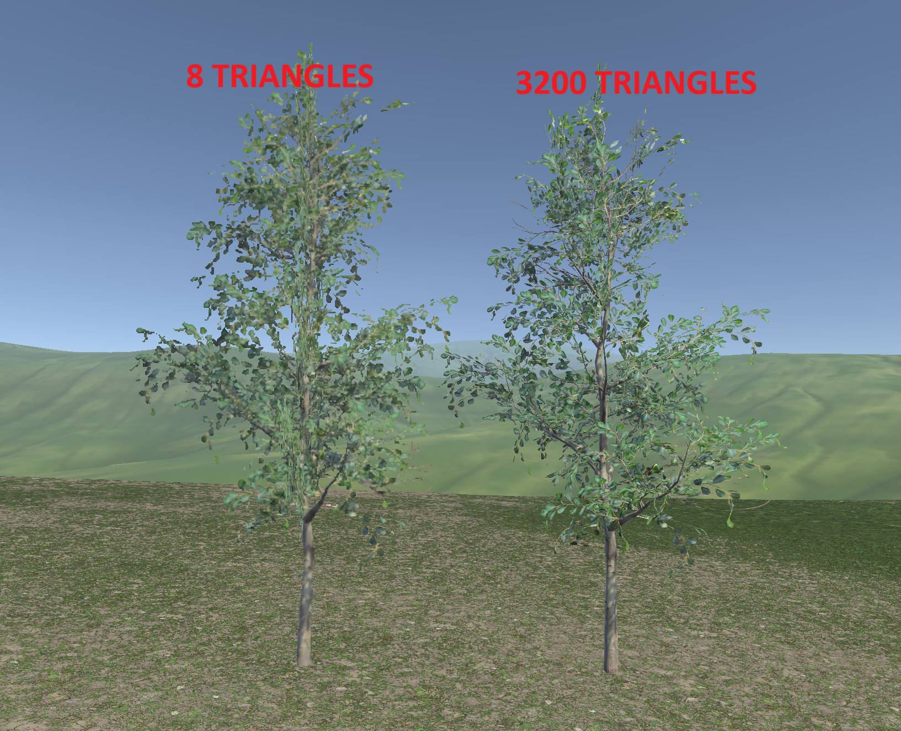

# Tree Cross Quad Impostor Generator

The **Tree Cross Quad Impostor Generator** is a Unity Editor tool designed to create optimized cross-quad impostors for tree or vegetation models. It generates a texture atlas with four snapshots (front, back, left, and right views), maps them onto cross-aligned quads, and optionally integrates an LOD system for enhanced rendering performance.

## Demo

#### 🎥 Click image to watch demo video

*TREES in this demo were created using this generator.*

## How It Works

1. **Input and Configuration:**
   - Select a source tree (GameObject).
   - Choose the desired texture atlas resolution (e.g., 512x512).
   - Optionally, adjust the positioning of each quad for fine-tuning.

2. **Snapshot Generation:**
   - The tool captures four directional views (front, back, left, and right) using a temporary orthographic camera.
   - These views are baked into a single texture atlas.

3. **Mesh and Material Creation:**
   - A cross-quad mesh is created with UVs corresponding to each snapshot.
   - A material using the **ImpostorCross.shader** is applied, supporting features like transparency and efficient instancing.

4. **LOD Integration:**
   - If enabled, the tool sets up an LOD group with the original tree at the highest level and the impostor at the lower level, ensuring smooth transitions.

5. **Output:**
   - A prefab containing the impostor is generated and saved, including its mesh, material, and texture atlas in proper folders.

## Features

- **Texture Atlas Generation:** Creates a 2x2 texture atlas with snapshots of four sides.
- **Quad Adjustment:** Fine-tune the position of each quad for accurate representation.
- **LOD Support:** Seamlessly integrates with Unity's LOD system.
- **Batching Friendly:** Impostor quads are static-batchable, reducing draw calls.
- **Performance Optimization:** Reduces polygon count drastically compared to original models.
- **Preview Mode:** Real-time visualization of impostors before finalizing.

## Advantages of Cross-Quad Impostors over Billboards

1. **Four-Sided Representation:** Unlike traditional billboards that rely on a single plane, cross-quad impostors provide a better 3D illusion with four directional snapshots.
2. **Static Batching:** Can be efficiently static-batched, reducing runtime overhead.
3. **Better Depth Perception:** Maintains visual fidelity from multiple angles.
4. **Customizable:** Each quad's offset can be adjusted for a fine-tuned appearance.

## Shader: ImpostorCross

The **ImpostorCross.shader** renders the impostor's cross quads using the generated texture atlas. It supports transparency, customizable cutoff values, and instancing for optimal performance in vegetation-heavy scenes.

## Usage

1. Open the tool via the Unity Editor: `Tools > Roundy > Tree Cross Quad Impostor Generator`.
2. Assign a tree model to the `Source Tree` field.
3. Configure the settings:
   - Select `Atlas Texture Size`.
   - Enable `Create LOD` if desired and set `LOD Transition Height`.
   - Adjust the offsets for each quad (front, back, left, and right).
4. Click **Preview Impostor** to visualize the impostor.
5. Click **Generate Final Impostor** to bake the impostor and save it as a prefab.

**Note on Lighting:** While the tool comes with an optimized unlit shader, you can easily add lighting to your impostors:
- Use any cutout-capable shader (Standard, URP/Lit, or custom)
- Simply change the shader on the generated material
- All the impostor functionality will remain intact
- Useful when impostors are viewed from closer distances or need to match lit scenes

## Requirements

- Unity 2020.3 or later
- URP/BIRP compatible

## Installation

1. Download the latest release package from the [Releases](https://github.com/roundyyy/TreeCrossQuadImpostorGenerator/releases/) page.
2. Import the package into your Unity project.
3. The tool will be available under `Tools/Roundy/Tree Cross Quad Impostor Generator`.

## Customization

### Quad Adjustments
Each quad's position can be fine-tuned using the sliders provided in the tool. Adjust these to ensure alignment with your source tree.

### LOD Configuration
Define the transition height for the LOD system to balance performance and visual fidelity.

## If you want to go deeper
IF you have many various trees, you can atlas them later easily with my other tool : https://github.com/roundyyy/LODOptimizer
This way you can static batch them together, even though impostors have different materials.

## Contributions

Contributions are welcome! Please fork the repository and submit a pull request with your improvements.

## License

This project is licensed under the MIT License. See the `LICENSE` file for details.
